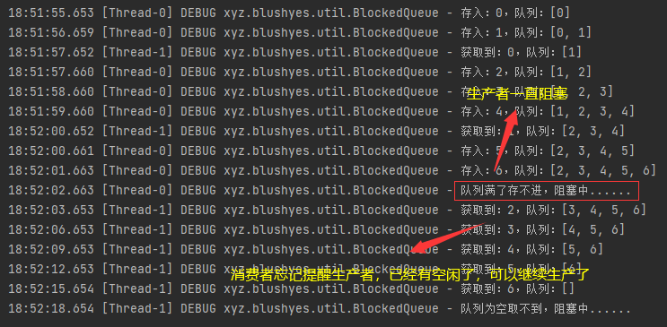
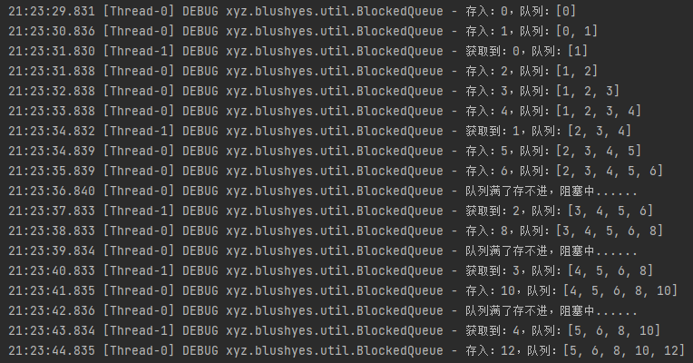
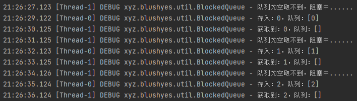

# 实现一个简单的阻塞队列

## 什么是阻塞队列？

> 阻塞队列是一种特殊的队列，它在队列为空的时候，从队头取数据的操作会被阻塞，直到有数据被放入队列；而在队列已满的时候，往队尾放数据的操作会被阻塞，直到队列中有空闲位置。阻塞队列在多线程环境下被广泛使用，通常用于实现生产者-消费者模型，可以有效地协调生产者和消费者之间的流量，避免了线程间的竞争和协作问题。

## 阻塞队列可以用来干什么？

阻塞队列可以用于解决生产者-消费者模型中的线程同步问题。在生产者-消费者模型中，生产者负责将数据放入队列中，而消费者则负责从队列中取出数据进行消费。因为生产者和消费者是并发执行的，所以需要使用阻塞队列来实现线程同步，避免数据竞争和线程协作的问题。
具体来说，阻塞队列可以实现以下功能：

- 实现线程之间的协作和同步，防止数据竞争和线程冲突。

- 控制线程的执行顺序，例如按照先进先出的顺序执行任务。

- 实现任务的缓存和批量处理，可以提高系统的吞吐量和性能。

- 实现流量控制和限流，可以避免系统资源的浪费和过载。

- 实现任务调度和定时执行，例如使用 DelayQueue 实现定时任务调度。
   总之，阻塞队列是一种非常强大和实用的数据结构，可以用于解决各种并发编程问题，提高系统的可靠性、可用性和性能。

## 实现

### 存储

既然是队列，那么肯定得用一个队列作为属性来存储：

~~~java
private final Deque<T> storage = new ArrayDeque<>();
~~~

### 加锁

由于要实现线程安全，肯定得加锁，这里选择用**ReentrantLock**实现，针对生产者和消费者单独进行阻塞，以提高效率：

~~~java
private final ReentrantLock lock = new ReentrantLock();

// 生产者阻塞状态
private final Condition publisherBlocked = lock.newCondition();

// 消费者阻塞状态
private final Condition consumerBlocked = lock.newCondition();
~~~

### 存入（错误版）

在存入元素之前，首先考虑一下队列是否已满，若已满，则进入生产者阻塞，否则就存入元素：

~~~java
public void offer(T e){
  lock.lock();

  while (storage.size() == capacity) {   // 如果队列已满，那么进入阻塞
      try {
          log.debug("队列满了存不进，阻塞中......");
          publisherBlocked.await();
      } catch (InterruptedException ex) {
          throw new RuntimeException(ex);
      }
  }

  storage.offer(e);
  log.debug("存入：{}，队列：{}", e, storage);

  lock.unlock();
}
~~~

### 取出（错误版）

在获取元素之前，首先考虑一下队列是否已空，若为空，则阻塞，否则就返回元素：

~~~java
public T poll(){
  lock.lock();

  while (storage.isEmpty()) {    // 如果队列为空，则进入阻塞
      try {
          log.debug("队列为空取不到，阻塞中......");
          consumerBlocked.await();
      } catch (InterruptedException e) {
          throw new RuntimeException(e);
      }
  }

  T res = storage.poll();
  log.debug("获取到：{}，队列：{}", res, storage);

  // 通知生产者可以继续生产了，队列中有空闲了
  publisherBlocked.signal();

  lock.unlock();

  return res;
}
~~~

### 运行

现在来运行测试一下：

~~~java
// 设置队列容量为5
BlockedQueue<Integer> blockedQueue = new BlockedQueue<>(5);

new Thread(()->{
   for (int i = 0; i < 100; ++i) {
       ThreadUtil.stop(1);
       blockedQueue.offer(i);
   }
}).start();

new Thread(()->{
   for (int i = 0; i < 100; ++i) {
       ThreadUtil.stop(3);
       blockedQueue.poll();
   }
}).start();
~~~

### 错误

果然，运行出错了，原因是没有通知阻塞中的生产者或者消费者重新干活：

### 解决

解决也不难，只需要通知一下对方即可，以存入为例：

~~~java
public void offer(T e){
   lock.lock();
   
   while (storage.size() == capacity) {   // 如果队列已满，那么进入阻塞
      try {
          log.debug("队列满了存不进，阻塞中......");
          publisherBlocked.await();
      } catch (InterruptedException ex) {
          throw new RuntimeException(ex);
      }
   }
   
   storage.offer(e);
   log.debug("存入：{}，队列：{}", e, storage);
   
   // 通知消费者队列中有元素了，可以起来干活了
   consumerBlocked.signal();
   
   lock.unlock();
}
~~~

再运行试试：

结果与预期的一样：由于生产者的生产速度大于消费者消费的速度导致最终队列容量变满，

最后消费者每次消费一个，生产者立马就会生产一个。

或者当生产者的速度慢与消费者时：

### 扩展

当然，还可以加入获取超时就放弃：

~~~java
public T poll(long timeout, TimeUnit timeUnit){
  lock.lock();

  long nanos = timeUnit.toNanos(timeout);

  while (storage.isEmpty()) {    // 如果队列为空，则进入阻塞
      try {
          if (nanos <= 0) {
              log.debug("超时，退出");
              break;
          }

          log.debug("队列为空取不到，阻塞中......");

          // 注意consumerBlocked.awaitNanos()返回的是剩余需要等待的时间
          // 如果没有等够时间，就被唤醒了，那么就会返回剩余的时间
          nanos = consumerBlocked.awaitNanos(nanos);
      } catch (InterruptedException e) {
          throw new RuntimeException(e);
      }
  }

  T res = storage.poll();
  log.debug("获取到：{}，队列：{}", res, storage);

  // 通知生产者可以继续生产了，队列中有空闲了
  publisherBlocked.signal();

  lock.unlock();
  return res;
}
~~~

值得注意的点有：

- TimeUnit的转换单位方法的使用。

- awaitNanos()方法的返回值为剩余的等待时间。

- 为什么要把nanos设置为剩余的时间呢？想象一下如果这个线程刚被唤醒，队列中的元素就被其他的线程消费了，导致它又得继续等待，如果不设置成剩余的时间，那么会导致又得重新等待最初设置的最大等待时间，这样是不合理的，与最大等待时间的目的相违背。

### 代码

~~~java
import lombok.extern.slf4j.Slf4j;

import java.util.ArrayDeque;
import java.util.Deque;
import java.util.concurrent.TimeUnit;
import java.util.concurrent.locks.Condition;
import java.util.concurrent.locks.ReentrantLock;

@Slf4j
public class BlockedQueue<T> {
   private final Deque<T> storage = new ArrayDeque<>();

   private final int capacity;

   private final ReentrantLock lock = new ReentrantLock();

   private final Condition publisherBlocked = lock.newCondition();

   private final Condition consumerBlocked = lock.newCondition();

   public BlockedQueue(int capacity) {
      this.capacity = capacity;
   }

   // 存入
   public void offer(T e){
      lock.lock();

      while (storage.size() == capacity) {   // 如果队列已满，那么进入阻塞
         try {
            log.debug("队列满了存不进，阻塞中......");
            publisherBlocked.await();
         } catch (InterruptedException ex) {
            throw new RuntimeException(ex);
         }
      }

      storage.offer(e);
      log.debug("存入：{}，队列：{}", e, storage);

      // 通知消费者队列中有元素了，可以起来干活了
      consumerBlocked.signal();

      lock.unlock();
   }

   // 取出
   public T poll(){
      lock.lock();

      while (storage.isEmpty()) {    // 如果队列为空，则进入阻塞
         try {
            log.debug("队列为空取不到，阻塞中......");
            consumerBlocked.await();
         } catch (InterruptedException e) {
            throw new RuntimeException(e);
         }
      }

      T res = storage.poll();
      log.debug("获取到：{}，队列：{}", res, storage);

      // 通知生产者可以继续生产了，队列中有空闲了
      publisherBlocked.signal();

      lock.unlock();

      return res;
   }

   // 有超时时间取出
   public T poll(long timeout, TimeUnit timeUnit){
      lock.lock();

      long nanos = timeUnit.toNanos(timeout);

      while (storage.isEmpty()) {    // 如果队列为空，则进入阻塞
         try {
            if (nanos <= 0) {
               log.debug("超时，退出");
               break;
            }

            log.debug("队列为空取不到，阻塞中......");

            // 注意consumerBlocked.awaitNanos()返回的是剩余需要等待的时间
            // 如果没有等够时间，就被唤醒了，那么就会返回剩余的时间
            nanos = consumerBlocked.awaitNanos(nanos);
         } catch (InterruptedException e) {
            throw new RuntimeException(e);
         }
      }

      T res = storage.poll();
      log.debug("获取到：{}，队列：{}", res, storage);

      // 通知生产者可以继续生产了，队列中有空闲了
      publisherBlocked.signal();

      lock.unlock();
      return res;
   }

   // 获取元素个数
   public int size(){
      return storage.size();
   }
}
~~~